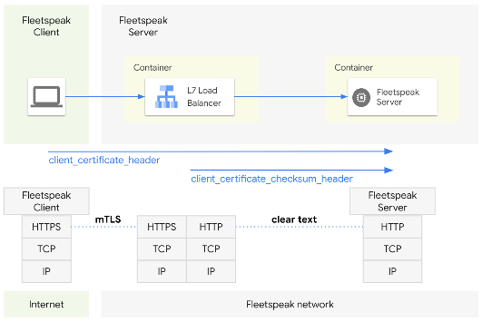

# Cleartext Header Mode

## Introduction

This sandbox demonstrates how to run Fleetspeak in 'cleartext header mode'.

The Fleetspeak frontend (the server) is using the Fleetspeak client's
certficiate to identify it by deriving the client id from the certficiate.

In cases where the mTLS connection is terminated on a load balancer between the
Fleetspeak client and the Fleetspeak server the client certificate has to be
forwarded by other means.

This sandbox demonstrates how this can be achieved by adding the certificate
into an additional header (the `client_certificate_header` in the diagram
below).

Furthermore, this sandbox also demonstrates how the client certificate checksum
(the `client_certificate_checksum_header` in the diagram below) that the load
balancers provide can be used to verify that the certificate received in the
additional header is the same that the load balancer received during the mTLS
exchange. \
Additional information on how the checksum is derived from the certificate can
be
[found here](https://datatracker.ietf.org/doc/html/draft-ietf-oauth-mtls-17#section-3.1).

The setup in this sandbox with the Fleetspeak frontend running in cleartext mode
would be useful for cases where the Fleetspeak server is operated in a Service
Mesh environment.



## Setup

Before you run the commands below make sure that you successfully executed the
steps outlined in the
[setup instructions](../../sandboxes#setup-instructions).

## Bring up the test environment

```
docker compose up --build -d

 ✔ Network cleartext-header-mode_default                Created                                                                                                      0.1s
 ✔ Container cleartext-header-mode-front-envoy-1        Started                                                                                                      0.1s
 ✔ Container cleartext-header-mode-mysql-server-1       Healthy                                                                                                      0.1s
 ✔ Container cleartext-header-mode-fleetspeak-server-1  Healthy                                                                                                      0.0s
 ✔ Container cleartext-header-mode-fleetspeak-client-1  Started                                                                                                      0.0s
```

## Find the client id

```
docker logs cleartext-header-mode-fleetspeak-client-1
# The output should look similar to the below

# config.go:44] Read 1 trusted certificates.
# manager.go:103] initial load of writeback failed (continuing): open /fleetspeak-client.state: no such file or directory
# manager.go:165] Using new client id: **768dbfef556d2341**
# client.go:175] No signed service configs could be read; continuing: invalid signed services directory path: unable to stat path [/config/fleetspeak-client/services]: stat /config/fleetspeak-client/services: no such file or directory
services.go:146] Started service hello with config:
#   name:"hello"  factory:"Daemon"  config:{[type.googleapis.com/fleetspeak.daemonservice.Config]:{argv:"/venv/FSENV/bin/python"  argv:"/config/hello.py"}}
# system_service.go:251] Unable to get revoked certificate list: unable to retrieve file, last attempt failed with: failed with http response code: 404

# Run the test app container
docker run -it --name greeter --network cleartext-header-mode_default -p 1337:1337 --rm greeter bash
```

## Run the test app

```
# In the above find the client id and export it in a variable
export CLIENT_ID=**768dbfef556d2341**

# Start the test app, when it runs add your input and hit enter. You should see the string being ecohed.
/venv/FSENV/bin/python ./greeter.py --client_id=$CLIENT_ID --fleetspeak_message_listen_address="0.0.0.0:1337" \
    --fleetspeak_server="fleetspeak-server:9091" --alsologtostderr
```

## Bring down the test environment

```
docker compose down
```
