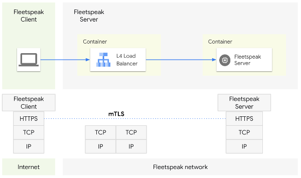

# Passthrough Mode

## Introduction

This sandbox demonstrates how to run Fleetspeak in 'passthrough mode'. \


## Setup

Before you run the commands below make sure that you successfully executed the
steps outlined in the
[setup instructions](../../sandboxes#setup-instructions).

## Bring up the test environment

```
docker compose up --build -d

[+] Running 5/5
 ✔ Network passthrough-mode_default                            Created                                                                                               0.1s
 ✔ Container passthrough-mode-mysql-server-1                   Healthy                                                                                               0.0s
 ✔ Container passthrough-mode-fleetspeak-server-1              Started                                                                                               0.0s
 ✔ Container passthrough-mode-fleetspeak-server-passthrough-1  Healthy                                                                                               0.0s
 ✔ Container passthrough-mode-fleetspeak-client-1              Started                                                                                               0.0s
```

## Find the client id

```
docker logs passthrough-mode-fleetspeak-client-1
# The output should look similar to the below

# config.go:44] Read 1 trusted certificates.
# manager.go:103] initial load of writeback failed (continuing): open /fleetspeak-client.state: no such file or directory
# manager.go:165] Using new client id: **46cdb0f943ee8f44**
# client.go:175] No signed service configs could be read; continuing: invalid signed services directory path: unable to stat path [/config/fleetspeak-client/services]: stat /config/fleetspeak-client/services: no such file or directory
# services.go:146] Started service hello with config:
#   name:"hello"  factory:"Daemon"  config:{[type.googleapis.com/fleetspeak.daemonservice.Config]:{argv:"/venv/FSENV/bin/python"  argv:"/config/hello.py"}}
# system_service.go:251] Unable to get revoked certificate list: unable to retrieve file, last attempt failed with: failed with http response code: 404

# Run the test app container
docker run -it --name greeter --network passthrough-mode_default -p 1337:1337 --rm greeter bash
```

## Run the test app

```
# In the above find the client id and export it in a variable
export CLIENT_ID=**46cdb0f943ee8f44**

# Start the test app, when it runs add your input and hit enter. You should see the string being ecohed.
/venv/FSENV/bin/python ./greeter.py --client_id=$CLIENT_ID --fleetspeak_message_listen_address="0.0.0.0:1337" \
    --fleetspeak_server="fleetspeak-server:9091" --alsologtostderr
```

## Bring down the test environment

```
docker compose down
```
